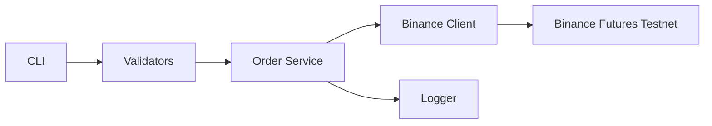

# Binance Futures Testnet Trading Bot

## Overview

This project is a simplified command-line trading utility built using Python for **Binance Futures USDT-M Testnet only**. It does not connect to Binance mainnet or spot markets.

The goal of the application is not to implement trading strategies or market analysis, but to demonstrate how a real trading system handles order execution, input validation, logging, and error handling in a clean and maintainable way.

The design closely follows how backend trading tools are structured in production environments — separating API access, validation, execution logic, and user interaction into independent components.

---

## Key Capabilities

- Place MARKET, LIMIT, and STOP_MARKET orders on Binance Futures Testnet  
- Support for both BUY and SELL sides  
- Command-line based execution using argparse  
- Input validation before sending any request to the exchange  
- Confirmation prompt to prevent accidental orders  
- Structured logging of requests, responses, and errors  
- Clean project structure with separation of concerns  

---

## Technology Stack

- Python 3.10+
- Binance Futures USDT-M Testnet (https://testnet.binancefuture.com)
- [python-binance](https://github.com/sammchardy/python-binance) (community Python SDK; `Client(testnet=True)` for Futures testnet)
- argparse for CLI handling
- python-dotenv for environment variables
- logging module from Python standard library

No paid services, cloud platforms, or billing-based tools are used.

### Futures Testnet REST endpoint

Order placement goes only through `bot.client.create_futures_client`, which passes `testnet=True` to [python-binance](https://github.com/sammchardy/python-binance). The SDK then routes `futures_create_order` to the USDT-M Futures Testnet host, not mainnet:

- **Base:** `https://testnet.binancefuture.com/fapi` (same as `Client.FUTURES_TESTNET_URL` in the SDK)
- **Order path:** `POST …/v1/order` → full URL `https://testnet.binancefuture.com/fapi/v1/order`

At startup, `create_futures_client` validates the testnet flag and order endpoint against public SDK constants. Spot and mainnet futures APIs are not used by this bot.

---

## Project Structure

```
trading-bot/
├── bot/
│   ├── client.py
│   ├── orders.py
│   ├── validators.py
│   ├── logging_config.py
│   └── cli.py
├── logs/
│   ├── market_order.log
│   ├── limit_order.log
│   └── stop_market_order.log
├── tests/
│   ├── test_validators.py
│   ├── test_client_order_payload.py
│   └── test_client_testnet_guard.py
├── .env.example
├── pyproject.toml
├── SETUP.md
├── requirements.txt
└── run.py
```

---

## Architecture

End-to-end flow: the CLI parses arguments, validators normalize and reject bad input before any network call, the order service logs and places the order through a testnet-only client, and file loggers record request/response or failure details.



### Request flow

1. `run.py` invokes `cli.main()`, which parses flags with argparse.
2. `validate_order_params()` runs immediately; invalid input never reaches the exchange.
3. After validation, the CLI prints a summary and prompts for confirmation (unless `--yes`).
4. Credentials load from `.env`; `create_futures_client()` builds a testnet-only `Client`.
5. `place_order()` logs the request, calls `place_futures_order()` → `futures_create_order` on the testnet host, logs the response, and prints a summary to stdout.

### Module responsibilities

| Module | Role |
|--------|------|
| `cli.py` | Argument parsing, confirmation prompt, env loading, exit codes, user-facing messages |
| `validators.py` | Symbol, side, type, quantity, and price rules; returns a normalized parameter dict |
| `orders.py` | Order orchestration: logging hooks, API call, response formatting, `OrderError` translation |
| `client.py` | Testnet client factory, endpoint guard, `futures_create_order` payload assembly |
| `logging_config.py` | Per-order-type file loggers (`market_order.log` / `limit_order.log`) |

### Validation flow

Validation runs in `validators.py` before credentials or API access. Each field has a dedicated check (symbol format, allowed side/type, positive numeric quantity, price required only for LIMIT). Failures raise `ValidationError`; the CLI catches these, prints a `Validation failed` block to stderr, and exits with code `1`.

### Logging flow

`orders.place_order()` selects a logger via `get_order_logger(order_type)` — MARKET and LIMIT write to separate files under `logs/`. The service logs the outgoing parameter dict (`log_request`), then either the exchange response summary (`log_response`) or a failure with stack trace (`log_error`). Secrets are never written to logs.

### Error handling

Errors are handled at layer boundaries so the CLI stays thin:

- **Input** — `ValidationError` → user message, no API call.
- **Configuration** — missing API keys → stderr message, exit `1`.
- **Client safety** — `create_futures_client()` asserts `testnet=True` and the expected order endpoint; mismatch raises `RuntimeError`.
- **Exchange** — `BinanceAPIException` / `BinanceRequestException` are caught in `orders.py`, logged, wrapped in `OrderError` (with a clearer message when notional is below 100 USDT), and surfaced as `Order failed: …`.
- **Unexpected** — any other exception prints a generic message to stderr; details belong in the log file when the order path was entered.

---

## Setup Instructions

### 1. Clone the repository

```
git clone <repository-url>
cd <repository-name>/trading-bot
```

All commands below assume your working directory is `trading-bot/` (where `run.py` lives).

For step-by-step API key creation on the Futures Testnet, see [trading-bot/SETUP.md](trading-bot/SETUP.md).

---

### 2. Create and activate a virtual environment

```
python -m venv venv
```

Windows:
```
venv\Scripts\activate
```

Linux / macOS:
```
source venv/bin/activate
```

---

### 3. Install dependencies

```
pip install -r requirements.txt
pip install -e .
```

The editable install adds a `primetrade` console command (same behavior as `python run.py`). `run.py` remains supported unchanged.

---

### 4. Configure environment variables

Create a `.env` file in `trading-bot/` (copy from `.env.example`). Keys must come from **Binance Futures Testnet** (https://testnet.binancefuture.com), not from mainnet Binance.

| Variable | Required | Description |
|----------|----------|-------------|
| `BINANCE_API_KEY` | Yes | Futures Testnet API key |
| `BINANCE_API_SECRET` | Yes | Futures Testnet API secret |

Example:

```
BINANCE_API_KEY=your_testnet_api_key
BINANCE_API_SECRET=your_testnet_api_secret
```

---

## Running the Application

Run from `trading-bot/` with the virtual environment activated. The CLI prints an order summary and prompts for confirmation unless you pass `--yes` (or `-y`).

After `pip install -e .`, you can use the `primetrade` command instead of `python run.py`:

```
primetrade --symbol BTCUSDT --side BUY --type MARKET --quantity 0.002 --yes
```

Binance Futures requires order notional (quantity × price) of at least **100 USDT**. The examples below use quantities that meet that minimum.

### Market Order

```
python run.py --symbol BTCUSDT --side BUY --type MARKET --quantity 0.002
```

Skip the confirmation prompt:

```
python run.py --symbol BTCUSDT --side BUY --type MARKET --quantity 0.002 --yes
```

### Limit Order

Limit orders require `--price`:

```
python run.py --symbol ETHUSDT --side SELL --type LIMIT --quantity 0.04 --price 2500
```

### Stop-Market Order

STOP_MARKET orders require `--stop-price` (trigger price). When the market reaches the stop price, Binance executes the order as a market order:

```
python run.py --symbol BTCUSDT --side SELL --type STOP_MARKET --quantity 0.002 --stop-price 90000
```

### Expected output

After you confirm with `y`, a successful order prints a green `✓ Order placed` header and a short result block (Order ID, Status, Executed qty, Avg price when available).

Limit and STOP_MARKET orders may show `Status: NEW` until filled or triggered. On failure, the CLI prints a red `✗` header (`Validation failed`, `Order failed`, etc.) with the detail to stderr. Colors apply when the terminal supports them. Request and response details are written to `logs/market_order.log`, `logs/limit_order.log`, or `logs/stop_market_order.log` by order type.

---

## Logging

All activity is logged under the `logs/` directory.

Logs include:

- Order request payloads
- Exchange responses
- Execution status
- Error messages and API failures

---

## Verification

From `trading-bot/`, run focused smoke tests (stdlib `unittest`, no API keys):

```
python -m unittest discover -s tests -v
```

CI runs the same checks on push and pull requests via `.github/workflows/smoke.yml`.

---

## Design Decisions

- No trading strategy logic included
- CLI-based execution similar to real trading systems
- Clear separation of concerns
- Minimal and stable dependencies only

---

## Assumptions

- Futures USDT-M Testnet environment only
- No websocket streaming
- Orders executed manually via CLI
- Focus strictly on execution layer reliability
- **STOP_MARKET:** `--stop-price` is the trigger only; execution is at market price once triggered. BUY stops fire when price rises to the stop; SELL stops fire when price falls to the stop (Binance default contract price). No `closePosition` or reduce-only flags — use explicit quantity like other order types. Minimum notional (100 USDT) may be evaluated against stop price × quantity at submission time.

---

## Production Considerations

This bot is a small CLI for testnet order placement. It is **not** production-hardened as shipped. The following gaps matter if you extend it beyond manual, one-off commands:

- **Retries** — Failed requests are surfaced once; there is no retry with backoff or distinction between transient network errors and permanent rejections.
- **Timeouts** — HTTP timeouts follow the python-binance / `requests` defaults; slow or hung calls are not bounded explicitly in this codebase.
- **Rate limits** — Binance enforces request weight and order-rate limits. This tool does not track usage, throttle, or handle `429` / `-1003` style responses beyond reporting the API error.
- **Reconciliation** — After submit, the CLI trusts the immediate API response. There is no follow-up query (e.g. `GET /fapi/v1/order`) to confirm final status, fills, or partial execution.
- **Idempotency** — Each run sends a new order. Retrying the same command after a timeout or crash can duplicate orders; there is no client order ID or deduplication layer.
- **Logging** — File logs under `logs/` are adequate for debugging a CLI. They are not structured for aggregation (JSON fields, correlation IDs, centralized shipping) without further work.

---

## Future Improvements

Reasonable next steps if the scope grows, without changing the current design:

- Add configurable timeouts and a small retry policy for idempotent-safe reads and clearly transient failures.
- Map common Binance error codes to actionable CLI messages; optionally backoff when rate-limited.
- Persist a client order ID (`newClientOrderId`) and expose a reconcile command that fetches order status by ID.
- Extend `logging_config` with optional JSON formatting or a single structured handler while keeping per-order-type files.
- Keep the execution layer thin; avoid adding strategy, portfolio, or multi-user features unless explicitly required.

---

## Notes

This project emphasizes clarity, correctness, and maintainability — key requirements when working with financial systems.
